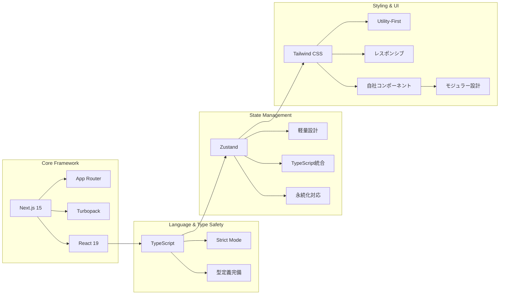
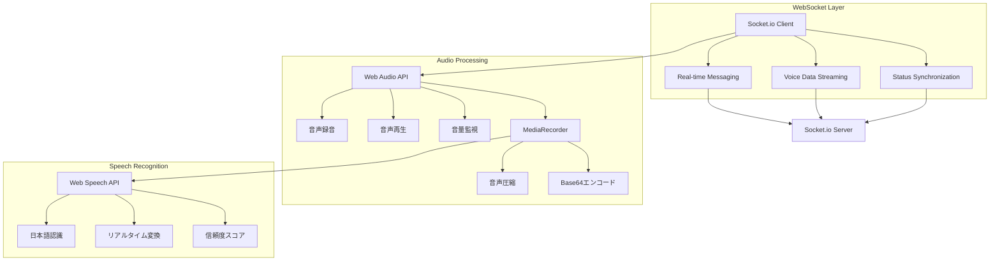
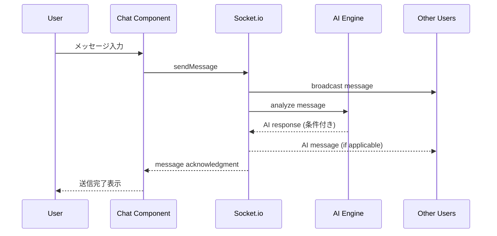
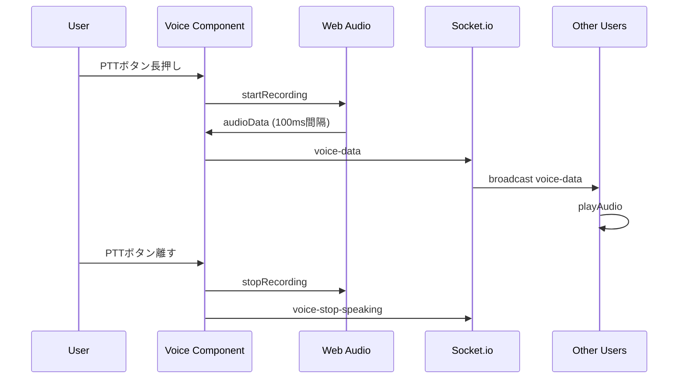
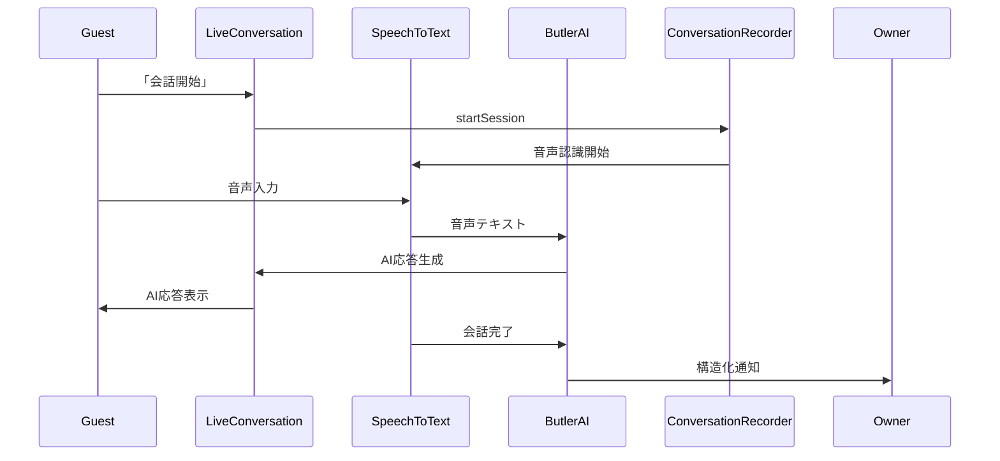

# Address AI Chat - システム構成図

## 🏗️ システム全体アーキテクチャ

```mermaid
graph TB
    subgraph "Frontend Layer (Client)"
        A[Next.js 15 + React 19]
        B[Tailwind CSS UI]
        C[Zustand State Management]
        D[TypeScript (Strict Mode)]
    end
    
    subgraph "Real-time Communication"
        E[Socket.io Client]
        F[Web Audio API]
        G[Web Speech API]
        H[MediaRecorder API]
    end
    
    subgraph "Backend Services"
        I[Socket.io Server]
        J[AI Processing Engine]
        K[Notification Service]
        L[Emergency Call Service]
    end
    
    subgraph "Data & Storage"
        M[LocalStorage<br/>開発環境]
        N[Supabase<br/>本番環境]
        O[Session Management]
        P[Conversation Records]
    end
    
    subgraph "External APIs"
        Q[Firebase Auth<br/>Mock実装]
        R[GPT-4o-mini<br/>準備済み]
        S[Web Notification API]
    end
    
    A --> E
    A --> F
    A --> G
    A --> H
    E --> I
    I --> J
    I --> K
    I --> L
    J --> R
    K --> S
    C --> M
    C --> N
    C --> O
    J --> P
    A --> Q
    
    classDef frontend fill:#e1f5fe
    classDef realtime fill:#f3e5f5
    classDef backend fill:#e8f5e8
    classDef storage fill:#fff3e0
    classDef external fill:#fce4ec
    
    class A,B,C,D frontend
    class E,F,G,H realtime
    class I,J,K,L backend
    class M,N,O,P storage
    class Q,R,S external
```

## 🚀 技術スタック詳細

### フロントエンド技術


### リアルタイム通信基盤


## 🎯 データフロー図

### メッセージング・フロー


### 音声通信フロー


### AI執事対話フロー


## 🔧 アーキテクチャの特徴

### 1. モジュラー設計
- **Feature-Based Architecture**: 機能ごとの独立モジュール
- **Separation of Concerns**: UI・ロジック・データの分離
- **Reusable Components**: 共通コンポーネントの活用

### 2. リアルタイム性
- **Socket.io**: WebSocketによる即座な同期
- **Optimistic Updates**: 楽観的更新でUX向上
- **Connection Resilience**: 接続断対応

### 3. 型安全性
- **TypeScript Strict Mode**: 完全な型安全性
- **Interface定義**: 全データ構造の型化
- **Runtime Validation**: 実行時型チェック

### 4. パフォーマンス最適化
- **Code Splitting**: 必要に応じた動的読み込み
- **Static Generation**: 事前レンダリング対応
- **Audio Compression**: 音声データの最適化

### 5. 開発効率
- **Hot Reload**: Turbopackによる高速開発
- **Auto-formatting**: Prettier + ESLint自動整形
- **Git Hooks**: 品質チェック自動化

## 📊 システム指標

| 項目 | 値 | 詳細 |
|------|-----|------|
| **ビルド時間** | 6秒 | Next.js + Turbopack |
| **First Load JS** | 99.5KB | 最適化済み |
| **静的ページ** | 11ページ | 事前生成対応 |
| **音声遅延** | <200ms | リアルタイム通信 |
| **認識精度** | >80% | Web Speech API |
| **接続成功率** | >95% | Socket.io fallback |

このアーキテクチャにより、スケーラブルで保守性の高いAI執事付きリアルタイム通信システムを実現しています。