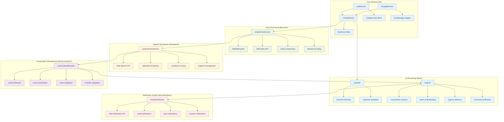
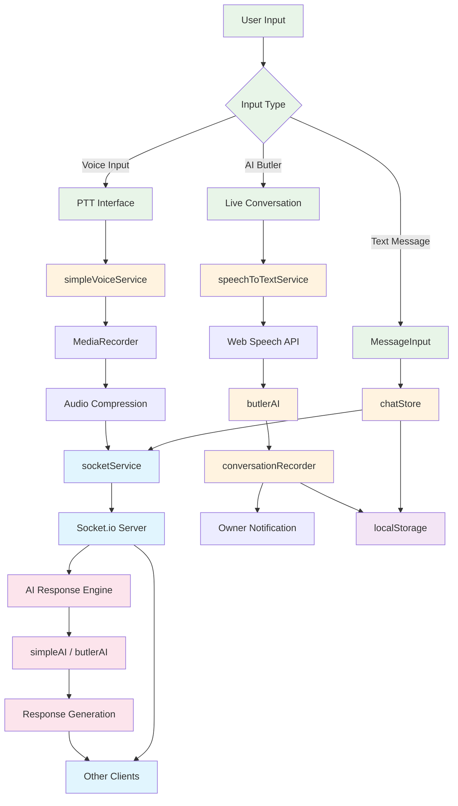
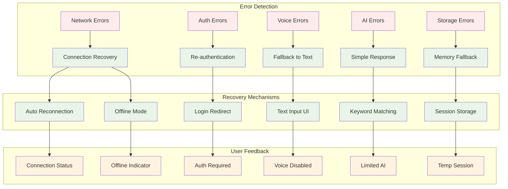

# Address AI Chat - 詳細コンポーネント関係図

## 🔗 Features・Lib層コンポーネント構造

### Features層 コンポーネント関係図

```mermaid
graph TB
    subgraph "Auth Feature"
        A1[LoginForm] --> A2[useAuth]
        A3[RegisterForm] --> A2
        A2 --> A4[MockAuthProvider]
        A4 --> A5[authStore]
    end
    
    subgraph "Chat Feature"
        B1[ChatRoom] --> B2[MessageList]
        B1 --> B3[MessageInput]
        B1 --> B4[RoomList]
        B1 --> B5[RoomCreationForm]
        B5 --> B6[chatStore]
        B1 --> B7[socketService]
    end
    
    subgraph "Directory Feature"
        C1[UserDirectory] --> C2[DirectorySearchBar]
        C1 --> C3[DirectorySortControl]
        C1 --> C4[directoryStore]
        C4 --> C5[mockUsers]
    end
    
    subgraph "Owner Status Feature"
        D1[StatusToggle] --> D2[statusStore]
        D2 --> D3[OwnerStatusDisplay]
        D1 --> D4[emergencyService]
    end
    
    subgraph "Emergency Feature"
        E1[EmergencyButton] --> E2[CallStatusDisplay]
        E1 --> E3[emergencyService]
        E3 --> E4[simpleNotification]
    end
    
    subgraph "Voice Transceiver Feature"
        F1[SimpleTransceiver] --> F2[PTTButton]
        F1 --> F3[ParticipantsList]
        F1 --> F4[VolumeIndicator]
        F1 --> F5[simpleVoiceService]
        F5 --> F6[socketService]
    end
    
    subgraph "AI Butler Feature"
        G1[LiveConversation] --> G2[conversationRecorder]
        G1 --> G3[speechToTextService]
        G1 --> G4[butlerAI]
        G5[OwnerNotificationPanel] --> G6[NotificationFilter]
        G5 --> G7[NotificationItem]
    end
    
    A2 --> B1
    B1 --> C1
    B1 --> D1
    D1 --> E1
    B1 --> F1
    F1 --> G1
    G4 --> G5
    
    classDef auth fill:#e3f2fd
    classDef chat fill:#e8f5e8
    classDef directory fill:#fff3e0
    classDef status fill:#f3e5f5
    classDef emergency fill:#ffebee
    classDef voice fill:#e1f5fe
    classDef butler fill:#fce4ec
    
    class A1,A2,A3,A4,A5 auth
    class B1,B2,B3,B4,B5,B6,B7 chat
    class C1,C2,C3,C4,C5 directory
    class D1,D2,D3,D4 status
    class E1,E2,E3,E4 emergency
    class F1,F2,F3,F4,F5,F6 voice
    class G1,G2,G3,G4,G5,G6,G7 butler
```

### Lib層 サービス・ユーティリティ関係図

### State Management 構造図

```mermaid
graph TB
    subgraph "Zustand Stores"
        ST1[authStore] --> ST2[user state]
        ST1 --> ST3[authentication]
        
        ST4[chatStore] --> ST5[rooms state]
        ST4 --> ST6[messages state]
        ST4 --> ST7[socket connection]
        
        ST8[directoryStore] --> ST9[users list]
        ST8 --> ST10[search filters]
        
        ST11[statusStore] --> ST12[owner status]
        ST11 --> ST13[AI proxy settings]
        
        ST14[transceiverStore] --> ST15[voice participants]
        ST14 --> ST16[audio state]
    end
    
    subgraph "Persistence Layers"
        P1[localStorage] --> P2[chat history]
        P1 --> P3[user preferences]
        P1 --> P4[emergency calls]
        P1 --> P5[conversations]
        
        P6[sessionStorage] --> P7[temporary data]
        P6 --> P8[voice sessions]
    end
    
    ST1 --> P1
    ST4 --> P1
    ST11 --> P1
    ST14 --> P6
    
    classDef store fill:#e8f5e8
    classDef persistence fill:#fff3e0
    
    class ST1,ST2,ST3,ST4,ST5,ST6,ST7,ST8,ST9,ST10,ST11,ST12,ST13,ST14,ST15,ST16 store
    class P1,P2,P3,P4,P5,P6,P7,P8 persistence
```

### データフロー詳細図

### Error Handling & Recovery 構造図

## 🔧 アーキテクチャ設計原則

### 1. 単一責任原則
- 各コンポーネントは明確な単一の責任を持つ
- サービス層とUI層の明確な分離
- 状態管理の集約化

### 2. 依存性注入
- サービスの疎結合設計
- インターフェース経由の依存関係
- テスタビリティの向上

### 3. エラー境界
- 各機能レベルでのエラーハンドリング
- グレースフルデグラデーション
- ユーザーフィードバックの一貫性

## 📊 パフォーマンス最適化ポイント

### メモリ管理
- 音声データの適切な解放
- コンポーネントのアンマウント処理
- WebSocket接続の管理

### ネットワーク最適化
- 音声データの圧縮
- 段階的な接続フォールバック
- リアルタイム通信の効率化

### UI最適化
- 仮想スクロール（準備済み）
- レイジーローディング
- メモ化によるレンダリング最適化

この詳細なコンポーネント関係図により、システム全体の構造と各要素間の依存関係が明確になります。