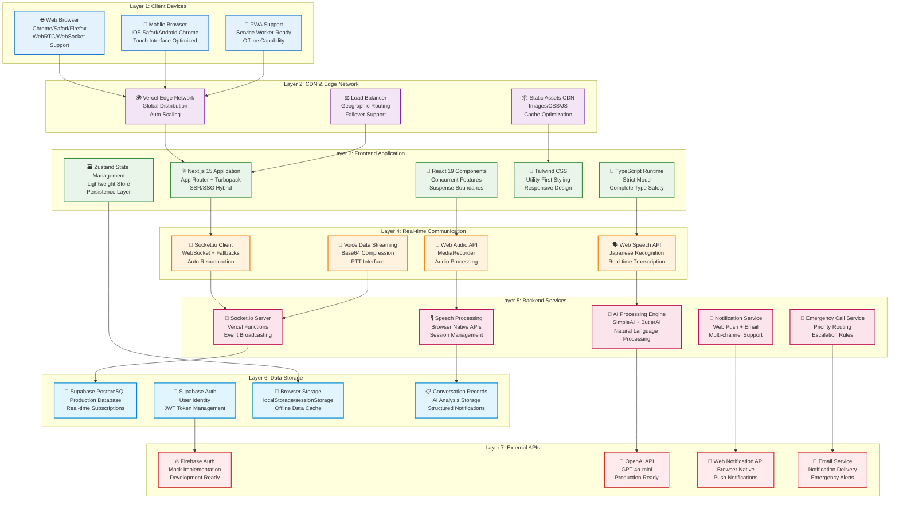
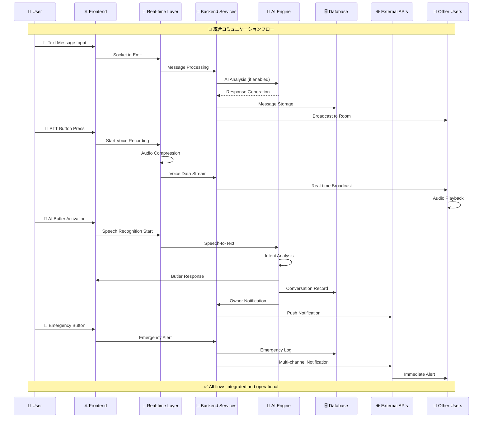
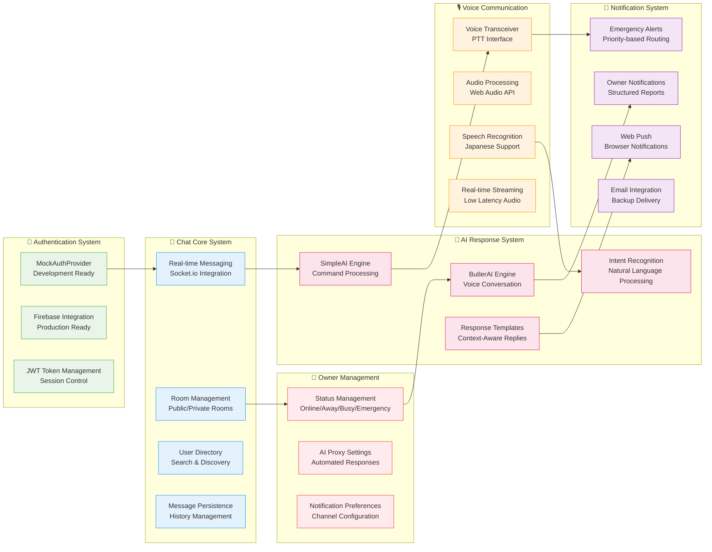
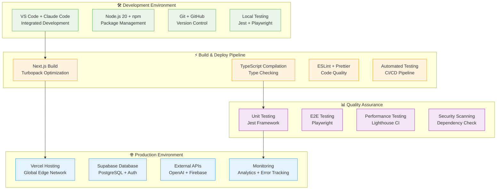

# Address AI Chat - 詳細アーキテクチャ図 (Draw.io形式)

## 🏗️ システム全体アーキテクチャ（7層構成）

### レイヤー構成図


## 🔄 データフロー詳細図

### メッセージング・音声・AI統合フロー


## 🏢 機能別アーキテクチャ構成

### Phase 1-4 統合システム構成


## 🔧 技術スタック詳細図

### Development & Production Environment


## 📋 Draw.io インポート手順

### 1. オンライン Draw.io での作成
1. **https://app.diagrams.net/** にアクセス
2. 「Create New Diagram」→「Blank Diagram」選択
3. 以下のレイヤー構成で作成：

### 2. レイヤー設定
```
Layer 1: Client Devices        (色: #E3F2FD)
Layer 2: CDN & Edge           (色: #F3E5F5)
Layer 3: Frontend App         (色: #E8F5E8)
Layer 4: Real-time Comm      (色: #FFF3E0)
Layer 5: Backend Services     (色: #FCE4EC)
Layer 6: Data Storage         (色: #E1F5FE)
Layer 7: External APIs        (色: #FFEBEE)
```

### 3. 図形配置ガイド
- **矩形**: 基本コンポーネント
- **円角矩形**: サービス・API
- **菱形**: 判定処理
- **矢印**: データフロー（実線：同期、破線：非同期）

### 4. エクスポート形式
- **PNG**: プレゼンテーション用
- **SVG**: ドキュメント埋め込み用
- **PDF**: 印刷用
- **XML**: Draw.io再編集用

この詳細なアーキテクチャ仕様を使用して、draw.ioで包括的なシステム構成図を作成できます。各レイヤーが明確に分離され、技術スタックと依存関係が視覚的に理解できる構成になっています。