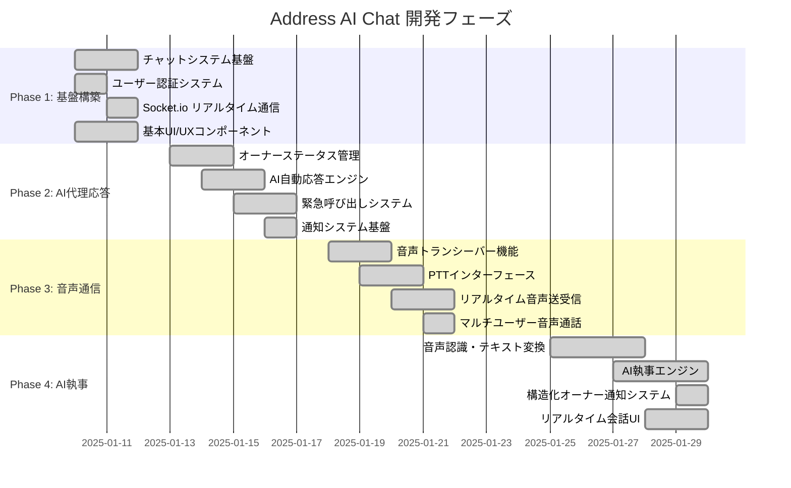
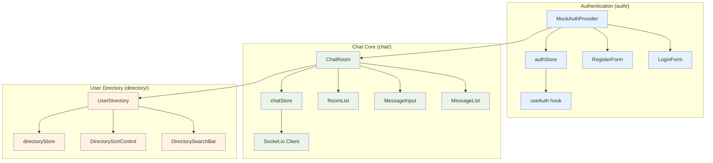
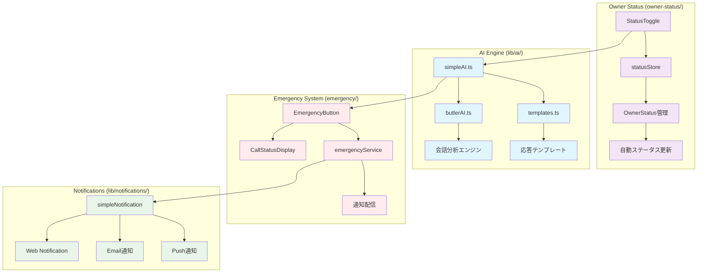
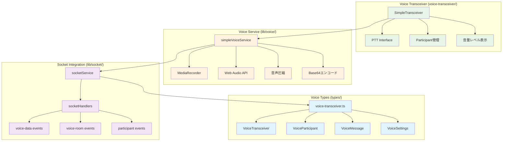
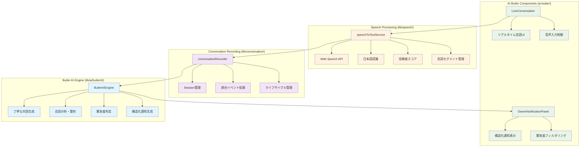
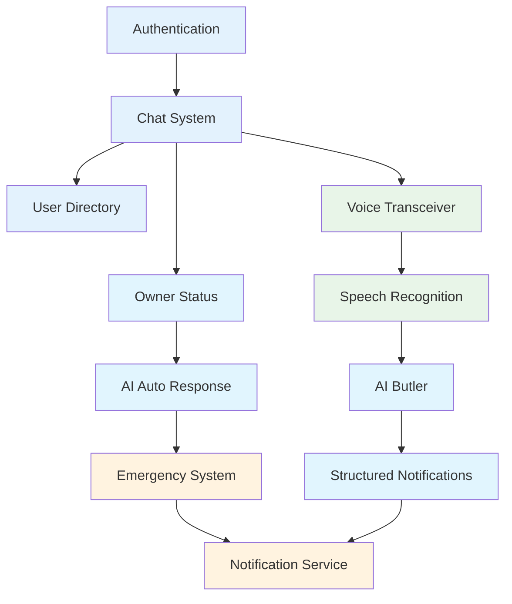

# Address AI Chat - 機能別モジュール構成図

## 🎯 Phase別実装状況マトリックス

## 🏗️ 機能別モジュール構成

### Phase 1: 基盤チャットシステム

### Phase 2: AI代理応答システム

### Phase 3: 音声通信システム

### Phase 4: AI執事システム

## 📊 機能完成度マトリックス

| 機能カテゴリ | Phase | 実装状況 | テスト状況 | ドキュメント |
|-------------|-------|---------|-----------|-------------|
| **認証システム** | 1 | ✅ 完了 | ✅ 完了 | ✅ 完了 |
| **チャット基盤** | 1 | ✅ 完了 | ✅ 完了 | ✅ 完了 |
| **ユーザーディレクトリ** | 1 | ✅ 完了 | ✅ 完了 | ✅ 完了 |
| **オーナーステータス** | 2 | ✅ 完了 | ✅ 完了 | ✅ 完了 |
| **AI自動応答** | 2 | ✅ 完了 | ✅ 完了 | ✅ 完了 |
| **緊急呼び出し** | 2 | ✅ 完了 | ✅ 完了 | ✅ 完了 |
| **音声トランシーバー** | 3 | ✅ 完了 | ✅ 完了 | ✅ 完了 |
| **リアルタイム音声** | 3 | ✅ 完了 | ✅ 完了 | ✅ 完了 |
| **音声認識・変換** | 4 | ✅ 完了 | ✅ 完了 | ✅ 完了 |
| **AI執事エンジン** | 4 | ✅ 完了 | ✅ 完了 | ✅ 完了 |
| **構造化通知** | 4 | ✅ 完了 | ✅ 完了 | ✅ 完了 |

## 🔄 機能間依存関係

## 🎯 次期開発計画

### Phase 5: 高度な機能（計画中）
- **本格AI API統合**: GPT-4o-mini API実装
- **Supabase統合**: 本番データベース対応
- **パフォーマンス最適化**: 仮想スクロール・キャッシュ戦略
- **セキュリティ強化**: 認証・認可システム本格化

### Phase 6: エンタープライズ機能（構想中）
- **多言語対応**: i18n国際化対応
- **オフライン対応**: PWA・ServiceWorker
- **モバイルアプリ化**: React Native移行検討
- **分析・ダッシュボード**: 使用状況分析機能

この機能構成により、段階的で保守性の高いAI執事付きリアルタイム通信システムを実現しています。