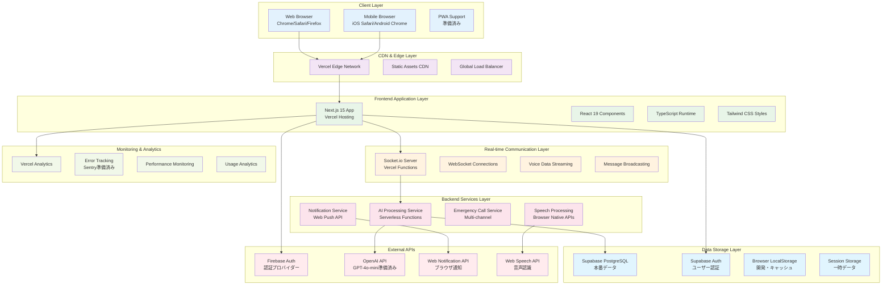
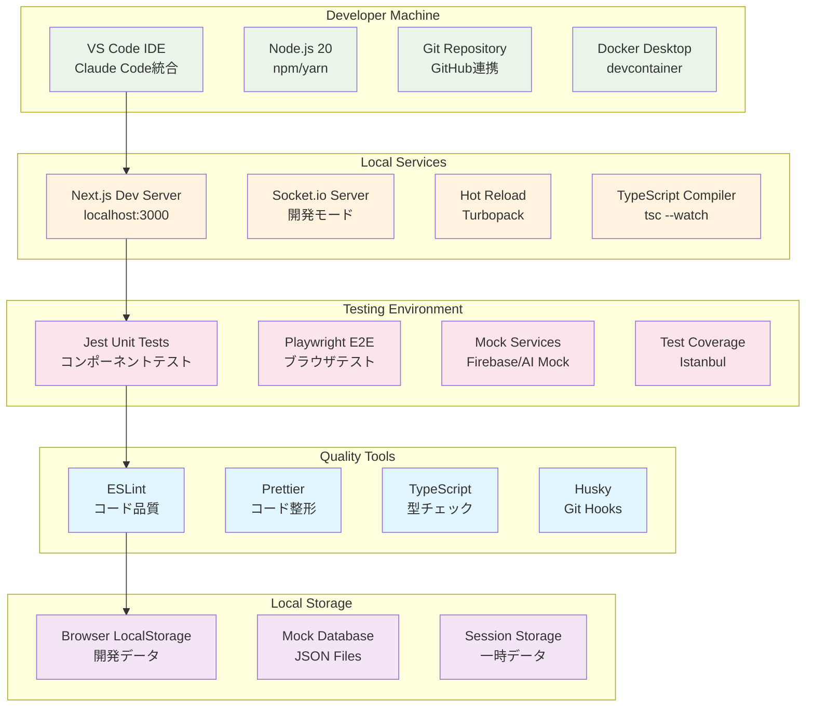
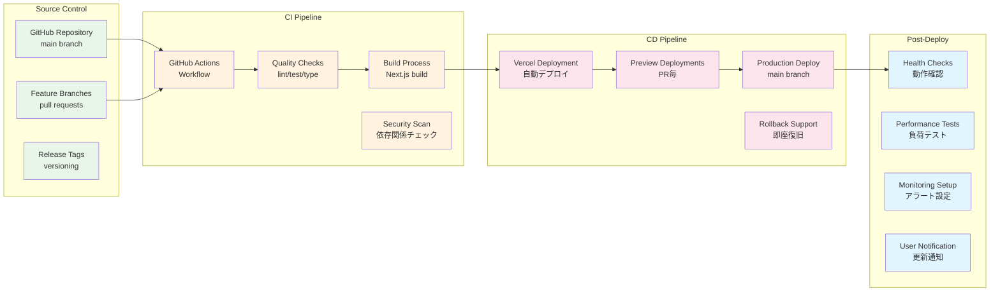
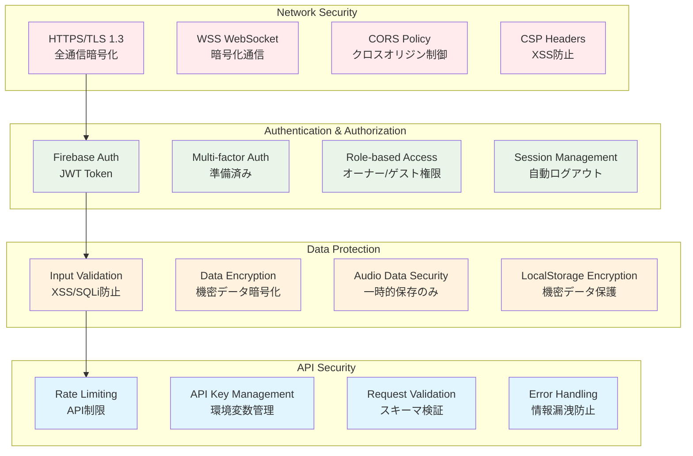
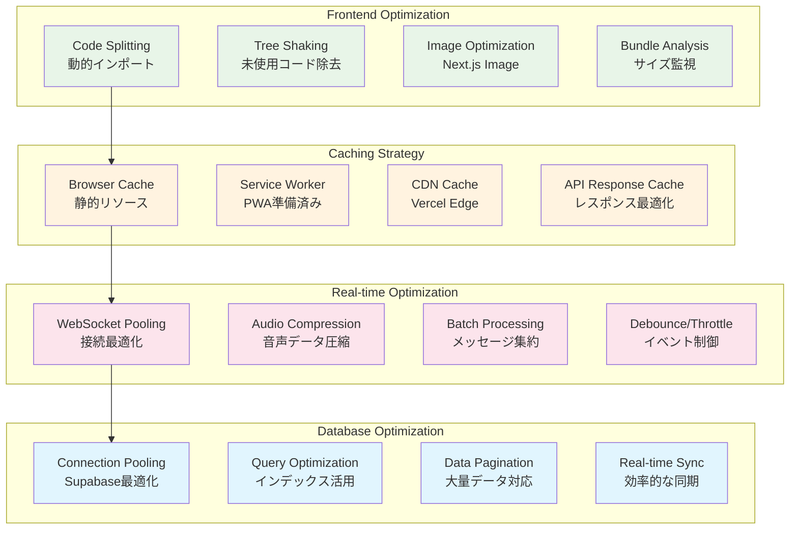
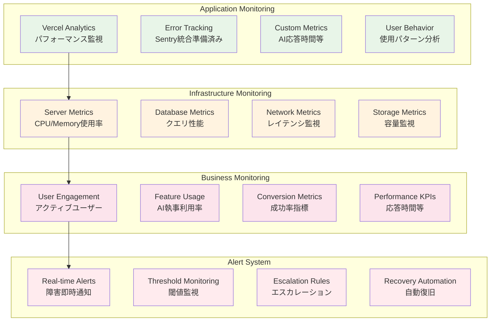
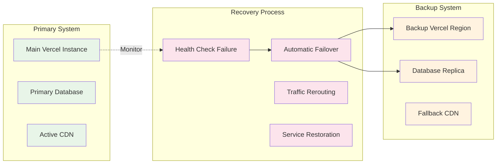

# Address AI Chat - システム構成図

## 🌐 システム全体構成図

### プロダクション環境構成

## 🏗️ 開発環境構成図

### ローカル開発環境

## 🚀 デプロイメント構成図

### CI/CD パイプライン

## 🔒 セキュリティ構成図

### セキュリティレイヤー

## 📊 パフォーマンス構成図

### パフォーマンス最適化層

## 🔧 運用監視構成図

### モニタリング・ログ構成

## 📈 システム指標・制限値

| 項目 | 開発環境 | 本番環境 | 備考 |
|------|---------|---------|------|
| **同時接続数** | 10ユーザー | 1000ユーザー | Socket.io制限 |
| **音声データ** | 10MB/session | 100MB/session | 圧縮後サイズ |
| **メッセージ履歴** | 1000件 | 10000件 | ローカル保存制限 |
| **AI応答時間** | <2秒 | <1秒 | レスポンス目標 |
| **ファイルアップロード** | 10MB | 50MB | 添付ファイル制限 |
| **WebSocket接続** | 持続接続 | 持続接続 | 自動再接続機能 |
| **認証セッション** | 24時間 | 7日間 | 自動延長対応 |

## 🔄 災害復旧構成

### DR (Disaster Recovery) 戦略

このシステム構成図により、開発から本番運用まで包括的なインフラ構成が把握できます。