# Address AI Chat - ユーザージャーニー図

## 👤 ユーザーロール別フロー

### オーナー（事業主・管理者）のワークフロー
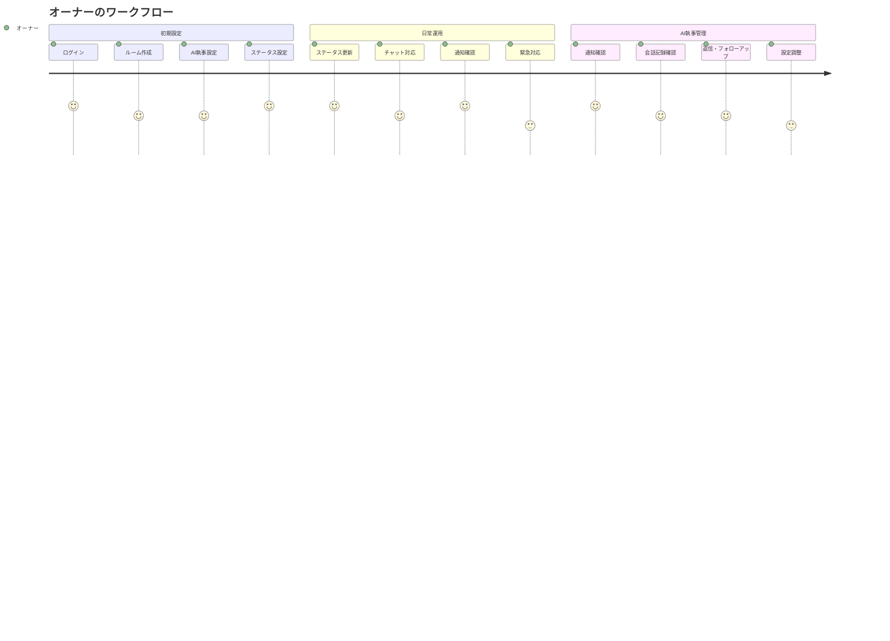

### ゲスト（訪問者・顧客）のワークフロー
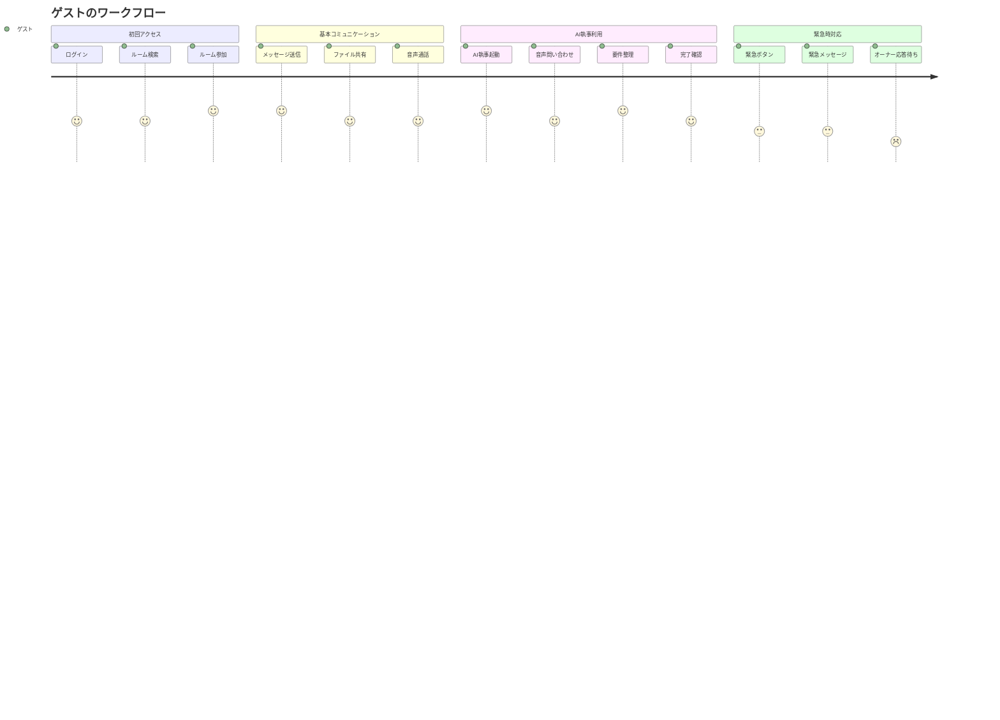

## 🤖 AI執事との対話フロー

### 標準的な問い合わせシナリオ
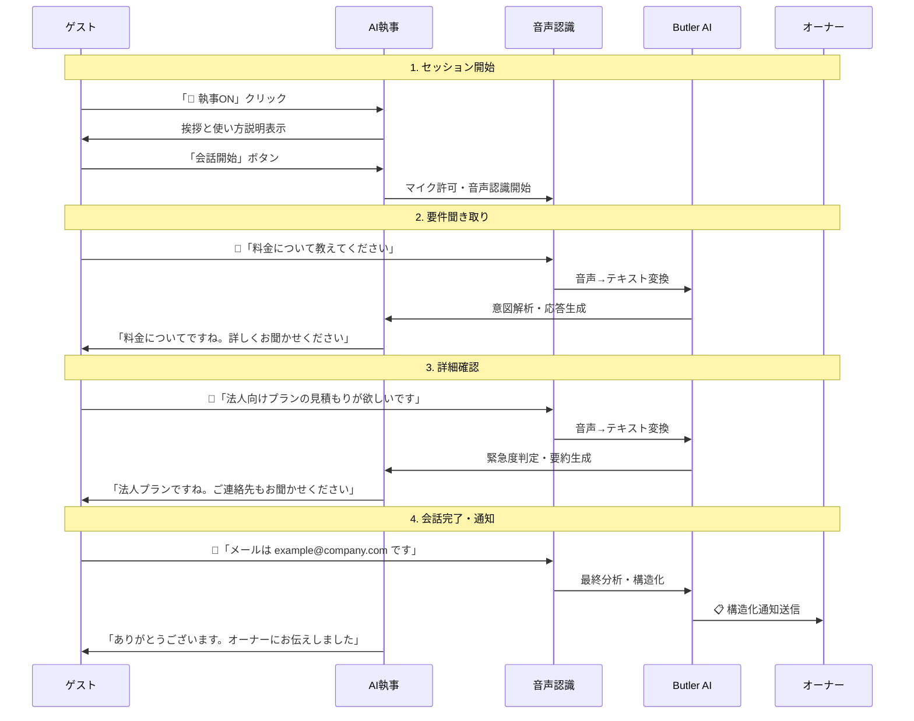

### 緊急時対応シナリオ
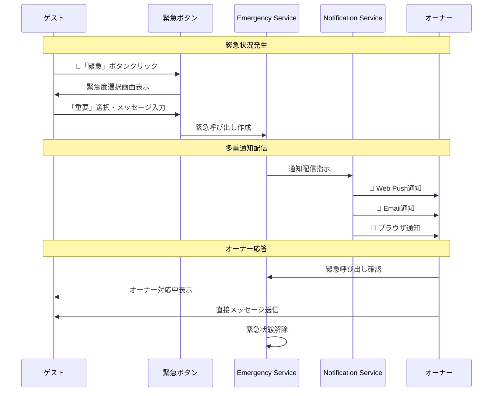

## 🎯 主要ユースケース詳細

### 1. 新規顧客の問い合わせ
```mermaid
flowchart TD
    A[ゲストログイン] --> B[ルーム検索]
    B --> C{オーナー在席?}
    C -->|オンライン| D[直接チャット]
    C -->|不在・取り込み中| E[AI執事起動]
    E --> F[音声で要件聞き取り]
    F --> G[AI分析・整理]
    G --> H[オーナーに構造化通知]
    H --> I[オーナーが後日対応]
    D --> J[リアルタイム対応]
    
    classDef start fill:#e8f5e8
    classDef decision fill:#fff3e0
    classDef ai fill:#e1f5fe
    classDef end fill:#f3e5f5
    
    class A start
    class C decision
    class E,F,G ai
    class I,J end
```

### 2. 既存顧客のサポート
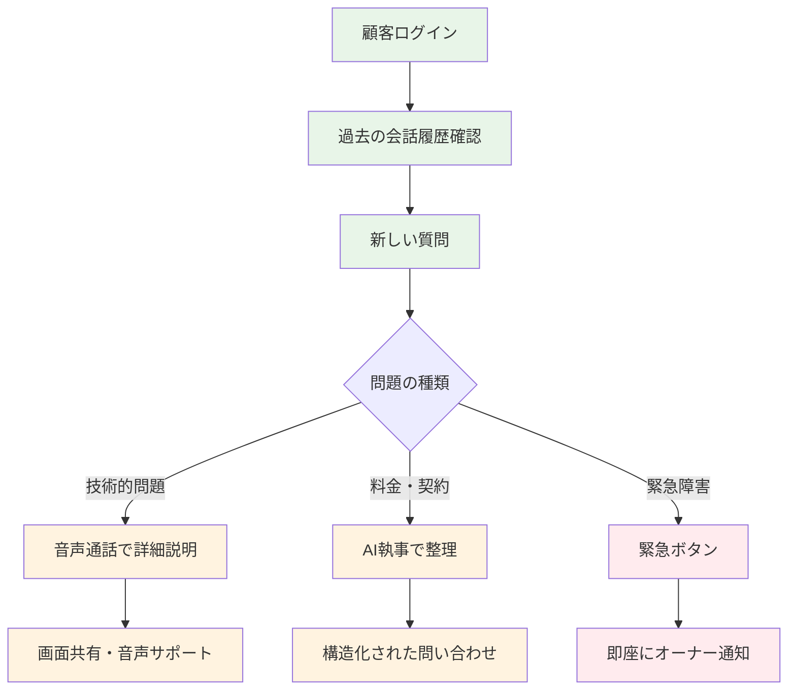

### 3. 複数ゲストの同時対応
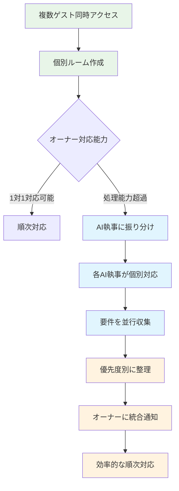

## 📱 デバイス別最適化フロー

### PC・デスクトップ環境
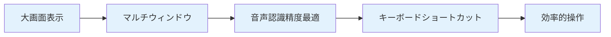

### モバイル・スマートフォン環境
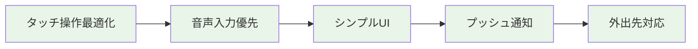

### タブレット環境
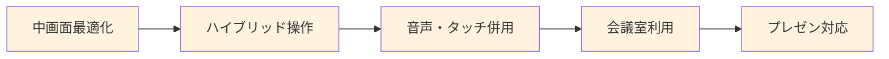

## 🔄 エラーハンドリング・フロー

### 接続エラー時の対応
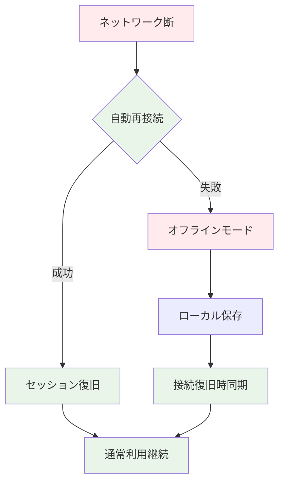

### 音声認識エラー時の対応
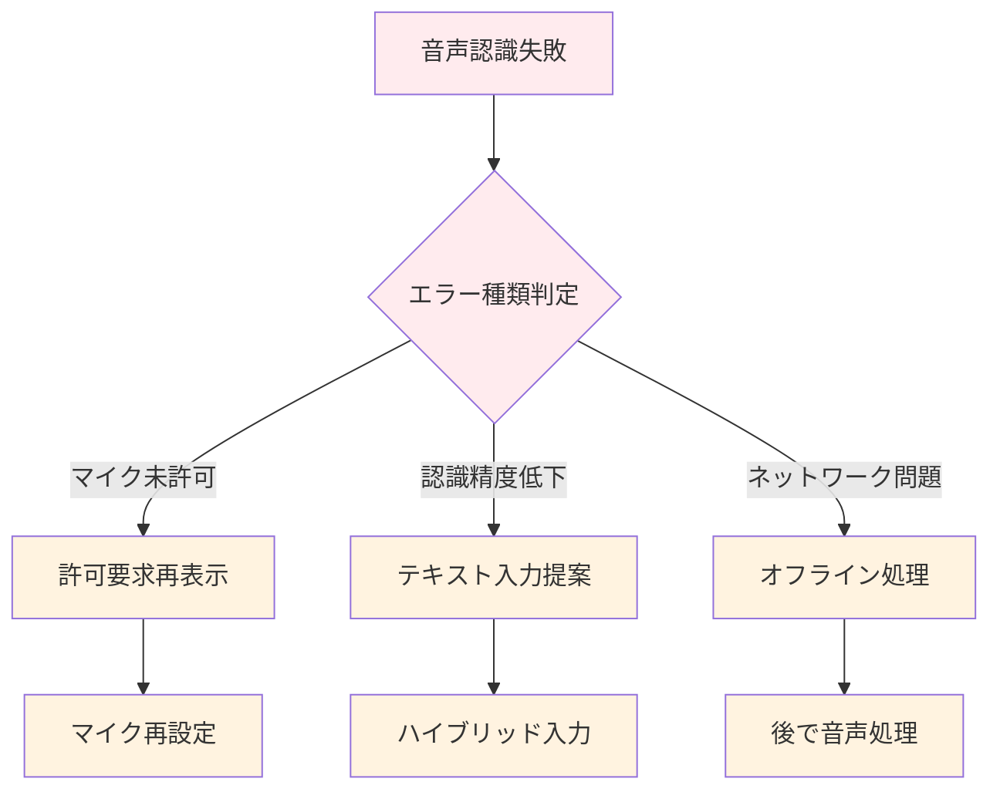

このユーザージャーニー設計により、オーナー・ゲスト双方にとって直感的で効率的なコミュニケーション体験を提供しています。